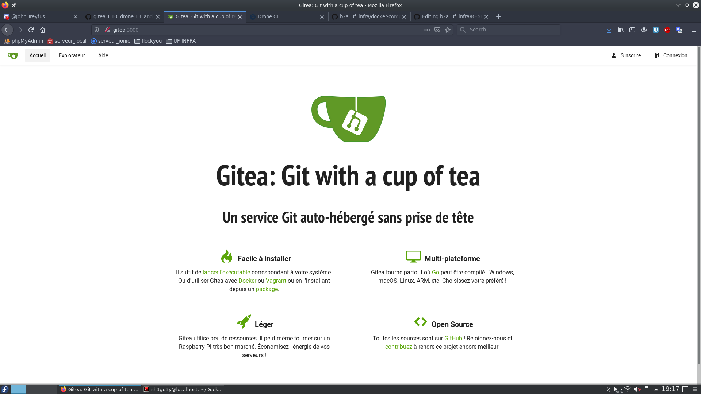

# b2a_uf_infra

## Théo

### Sécuriser l'accès SSH

https://community.gladysassistant.com/t/tutoriel-securiser-lacces-ssh-sur-votre-raspberry/2157

-   Demander le mot de passe pour l'utilisation de `sudo`

    ```
    $ cd /etc/sudoers.d
    $ sudo mv 010_pi-nopasswd 010_pi-passwd
    $ sudo vi 010_pi-passwd
    ```

    Modifier la ligne :

    ```
    pi ALL=(ALL) NOPASSWD: ALL
    ```

    En :

    ```
    pi ALL=(ALL) PASSWD: ALL
    ```

-   Copier le fichier de configuration SSH (au cas ou hein)

    ```
    $ cd /etc/ssh
    $ sudo cp sshd_config sshd_config.orig
    ```

-   Dans le fichier de config `/etc/ssh/sshd_config`

    -   Modifier le port d'ecoute de SSH _(22 par défaut)_ :  
        Port SSH passé sur le port **2222**

    -   Établir un temps pour se connecter :  
        `LoginGraceTime 30` (30sec pour se connecter avant fermeture du SSH)

    -   Nombre de tentative de mot de passe avant fermeture SSH :  
        `MaxAuthTries 1` (1 erreur et SSH fermé)

    -   Temps d'inactivité avant déconnexion :  
        `ClientAliveInterval 900` (15min d'inactivité et SSH raccroche)

    -   Redemarrer le service SSH
        ```
        sudo systemctl restart ssh
        ```

-   Authentification par clés SSH

    -   Sur **HOST** :

        -   Créer une paire de clés publique et privé sur le host

            ```
            ssh-keygen -t rsa -b 2048 -C "Un commentaire pour vous aider à identifier votre clé"
            ```

        -   Copier la clé publique sur la raspberry
            ```
            cd ~/.ssh
            scp id_rsa.pub pi@my_raspberry_ip:~/.ssh/authorized_keys
            ```
        -   Possibilité de se connecter a la raspberry en utilisant sa clé privé
            ```
            ssh pi@my_raspberry_ip -p <ssh_port> -i ~/.ssh/id_rsa
            ```

    -   Sur **RASPBERRY** :
        -   Dans le fichier `/etc/ssh/sshd_config`
            ```
            PasswordAuthentication no
            ChallengeResponseAuthentication no # this should be the default anyway
            UsePAM no
            ```
        -   Redemarrer le service SSH
            ```
            sudo service ssh restart
            ```

    On est maintenant obligé de se connecté au serveur avec nos clés privé, sinon l'accès est refusé

## Maxime

### I- Connexion à la raspberry à distance
#### Local
Pour connecter ma raspberry à mon réseau personnel, il faut tout d'abord éditer le fichier [wpa_supplicant.conf](connexion_raspberry/wap_supplicant.conf) avec les informations relatives à mon réseau.

Maintenant qu'elle est connectée, nous pouvons repérer son adresse IP avec `ifconfig` ou sur le panel d'administration de mon opérateur.
Selon l'opérateur, l'interface est différent (et potentiellement les menus), mais le protocole est identique. Dans le un menu faisant référence au `NAT/PAT`, nous allons pouvoir ouvrir des ports à notre raspberry.

Nous définissons à notre `Équipement` Raspberry un service `HTTP` avec un `Protocole` TCP sur le `Port` 80. Nous ferons de même avec un `Service` HTTPS sur le `Port` 80. Ainsi nous pouvons rediriger des requêtes web vers notre Raspberry.

Néanmoins, nous ne pouvons y accèder que dans le même réseau. Il faut mettre en place un `DynDNS`.

#### DynDNS
Ce service permet de donner à un DNS (associe une IP à une adresse URL) à une adresse dynamique.

Nous utiliserons ce service sur https://noip.com qui le fourni gratuitement. Après avoir créée un compte, nous pouvons choisir un nom de domaine, qui sera : https://myraspberry.sytes.net . Il faut maintenant retourner dans le panel d'administration de mon réseau pour reliée la box à ce compte.

Pour configurer la box, on se retrouve dans le menu `DynDNS` où il est possible d'y ajouter une règle. Dans laquelle nous définissons notre `Service` sur no-ip et fournissons le nom de domaine choisi et les informations relatives au compte demandées.

Après avoir redémarré la box, nous pouvons y accèder depuis l'extérieur du réseau !

### II- Mise en place de Git sur la Raspberry
La noyau de notre projet est évidemment le logiciel de versionning `git`. Il nous faut absolument l'installer sur la machine : `sudo apt install git`

### III- Configuration Gitea & Nginx

-   Création de l'user associé à Gitea :
    `sudo adduser --disabled-login --gecos 'Gitea' git`

-   Téléchargement et installation de Gitea :
    `wget -O gitea https://dl.gitea.io/gitea/1.4.0/gitea-1.10.0-linux-arm-6`

-   Le rendre executable :
    `chmod +x gitea`

-   Configuration du service Gitea :

    ```
    // /etc/systemd/system/gitea.service

    [Unit]
    Description=Gitea
    After=syslog.target
    After=network.target
    After=mariadb.service mysqld.service postgresql.service memcached.service redis.service

    [Service]
    # Modify these two values and uncomment them if you have
    # repos with lots of files and get an HTTP error 500 because
    # of that
    ###
    #LimitMEMLOCK=infinity
    #LimitNOFILE=65535
    Type=simple
    User=git
    Group=git
    WorkingDirectory=/home/git
    ExecStart=/home/git/gitea web
    Restart=always
    Environment=USER=git HOME=/home/git

    [Install]
    WantedBy=multi-user.target
    ```

-   Activation et lancement de Gitea :
    ```
    sudo systemctl enable gitea
    sudo systemctl start gitea
    ```
-   Installation de Nginx :
    `sudo apt-get install nginx -y`

-   Modifications du fichier de configuration :
    ```
    // /etc/nginx/sites-available/gitea

    server {
        listen 443 ssl;
        server_name rpi-git myraspberry.sytes.net;
        ssl_certificate     /etc/letsencrypt/live/myraspberry.sytes.net/fullchain.pem;
        ssl_certificate_key /etc/letsencrypt/live/myraspberry.sytes.net/privkey.pem;

        location / {
            client_max_body_size 364M;
            proxy_pass http://localhost:3000;
            proxy_connect_timeout 600;
            proxy_send_timeout 600;
            proxy_read_timeout 600;
            send_timeout 600;
            proxy_set_header X-Real-IP $remote_addr;
        }
    }

    server {
        listen 80;
        server_name rpi-git myraspberry.sytes.net;
        return 301 https://$host$request_uri;
    }
    ```

-   Activation de Gitea avec nginx :
    ```
    sudo ln -s /etc/nginx/sites-available/gitea /etc/nginx/sites-enabled/gitea
    sudo rm /etc/nginx/sites-enabled/default
    sudo service nginx restart
    ```

-   Téléchargement et activation du certificat SSL :
    ```
    wget https://dl.eff.org/certbot-auto
    chmod a+x certbot-auto
    sudo ./certbot-auto certonly --standalone -d myraspberry.sytes.net
    ```

-   Reload certificat SSL grâce à une tâche cron (crontab) :
    `0 1 2 * * sudo service nginx stop && sudo /home/pi/certbot-auto renew && sudo service nginx start`

-   Redémarrage Nginx pour appliquer les nouveaux paramètres  :
    `sudo service nginx restart`

Nous obtenons maintenant la superbe interface tant attendue de Gitea !


